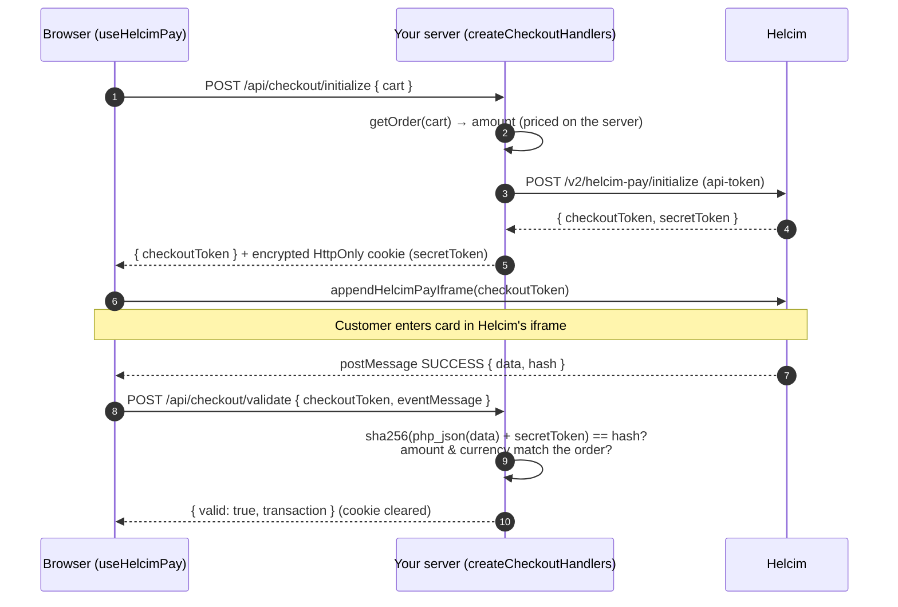

# useHelcimPay

[](https://github.com/Trust-007/useHelcimPay/actions/workflows/ci.yml)
[](LICENSE)

**A TypeScript-first React hook for [HelcimPay.js](https://devdocs.helcim.com/docs/overview-of-helcimpayjs), plus the server helpers it needs.**

> [!IMPORTANT]
> **Unofficial project.** Not affiliated with, endorsed by, or sponsored by Helcim Inc. See the [Disclaimer](#disclaimer).

**Live demo:** _coming soon (Vercel)_ <!-- TODO: add the Vercel URL after the first deploy -->

```tsx
const { startCheckout, status, error, result } = useHelcimPay({ ...checkoutClient });
```

## Why this exists

Helcim's embedded payment modal, HelcimPay.js, ships as **vanilla JavaScript only**. At the time of writing there's no official React integration, and the one community package we found takes a class-based approach rather than hooks.

So every React app ends up hand-wiring the same three steps from Helcim's docs:

1. **Initialize.** Create a checkout session on your server. The API token can't touch the browser, and Helcim blocks browser calls with CORS.
2. **Render.** Load `start.js`, call `appendHelcimPayIframe()`, and listen for `postMessage` events named `helcim-pay-js-<token>` with statuses `SUCCESS`, `ABORTED` and `HIDE`.
3. **Validate.** Re-compute Helcim's response hash on your server with the checkout's secret token.

Each step has a trap:

- **State:** the iframe lifecycle and message listener don't map cleanly onto React state.
- **Secrets:** the secret token must not leak to the browser.
- **Hashing:** the hash is computed over **PHP-style JSON**, so a straightforward JavaScript port (`JSON.stringify`) fails on amounts like `10.00`, invoice numbers with `/`, or accented names ([details](packages/use-helcim-pay/README.md#why-the-hash-check-is-harder-than-it-looks)).

`use-helcim-pay` packages all of that into one hook, a few Web-standard server helpers, and a simulator for testing without a Helcim account.

## What's in the box

|                                |                                                                                                                                                                                                                                  |
| ------------------------------ | -------------------------------------------------------------------------------------------------------------------------------------------------------------------------------------------------------------------------------- |
| **`useHelcimPay()`**           | Hook with a typed state machine (`initializing → open → validating → success`, plus `declined`, `closed` and `error`). Handles script loading, the iframe, message filtering, retries after a decline, token expiry and cleanup. |
| **`createCheckoutHandlers()`** | Drop-in `initialize` and `validate` endpoints (`Request → Response`) for Next.js, Remix, Hono and Workers. The price comes from the server, the secret stays in an encrypted cookie, and receipts can't be replayed.             |
| **`validateTransaction()`**    | Hash check that matches Helcim's PHP encoding byte-for-byte, plus amount, currency and approval checks.                                                                                                                          |
| **`createHelcimSimulator()`**  | A stateless stand-in for Helcim's API, `start.js` and payment modal, with real hashes and test cards only. It powers the demo and the test suite.                                                                                |

Full API documentation: **[packages/use-helcim-pay/README.md](packages/use-helcim-pay/README.md)**

## How it fits together



## Quick look

```ts
// app/api/checkout/[action]/route.ts (server)
const { initialize, validate } = createCheckoutHandlers<Cart>({
  apiToken: process.env.HELCIM_API_TOKEN!,
  cookieSecret: process.env.CHECKOUT_COOKIE_SECRET!,
  getOrder: (cart) => ({ amount: priceCart(cart), currency: 'CAD' }),
  onVerified: ({ transaction }) => markOrderPaid(transaction),
});
```

```tsx
// PayButton.tsx (client)
const checkoutClient = createCheckoutClient<Cart>({
  initializeUrl: '/api/checkout/initialize',
  validateUrl: '/api/checkout/validate',
});

function PayButton({ cart }: { cart: Cart }) {
  const { startCheckout, status, isBusy, isOpen, error } = useHelcimPay({ ...checkoutClient });
  return (
    <button disabled={isBusy || isOpen} onClick={() => startCheckout(cart)}>
      {status === 'validating' ? 'Verifying…' : 'Pay'}
    </button>
  );
}
```

## Repository layout

```text
packages/use-helcim-pay/   the library: hook, server helpers and simulator (tsdown, Vitest)
apps/demo/                 Next.js 16 checkout demo, deployed on Vercel
.github/workflows/ci.yml   format, lint, typecheck, test, package checks, build
```

## Development

Requires Node 20 or later and npm 7 or later (npm workspaces).

```bash
npm install
npm run dev -w use-helcim-pay-demo   # builds the library, then starts the demo at http://localhost:3000
```

| Command                                   |                                                                                                                  |
| ----------------------------------------- | ---------------------------------------------------------------------------------------------------------------- |
| `npm test`                                | Library test suite (Vitest + happy-dom, about 2 s)                                                               |
| `npm run typecheck`                       | TypeScript across both workspaces                                                                                |
| `npm run lint` / `npm run format:check`   | ESLint / Prettier                                                                                                |
| `npm run build`                           | Build the library and the demo                                                                                   |
| `npm run check:package -w use-helcim-pay` | [publint](https://publint.dev) + [are-the-types-wrong](https://arethetypeswrong.github.io) on the packed tarball |

The demo runs in **simulator mode** with no configuration. See [apps/demo/README.md](apps/demo/README.md) for environment variables, live mode and Vercel deployment.

## Status and limitations

- **Not on npm yet.** `0.1.0` is publish-ready: the tarball, ESM and CJS builds and type declarations are verified with publint and attw.
- **Verified against docs and a simulator, not yet a live Helcim account.** The message parser accepts every `eventMessage` shape seen in Helcim's docs and in published integrations, and the hash encoders are tested against real CPython output. If you run it against a live account and hit a problem, please open an issue.
- **A dev-only audit notice.** `npm audit` reports one low-severity advisory in `esbuild` (its dev server on Windows), pulled in by Vitest's Vite. The library and the demo don't ship or run it.

## Disclaimer

- **Not affiliated with Helcim.** This is an independent, unofficial open-source project. It is not affiliated with, endorsed by, sponsored by, or supported by Helcim Inc. For help with Helcim's products, contact Helcim directly.
- **Trademarks.** Helcim and HelcimPay are trademarks of Helcim Inc. They are used here only to identify the service this software works with (nominative use). No Helcim logos or brand assets are used.
- **Independent implementation.** The library and its simulator were written from Helcim's publicly available developer documentation. They contain no Helcim source code, and no Helcim software was copied, decompiled or reverse-engineered.
- **The demo is only a demo.** The demo store is fictional, sells nothing, and by default processes no real payments: checkout runs against the built-in simulator, which accepts only published test card numbers and does not store card details. Never enter real card details into the demo.
- **No warranty.** The software is provided "as is", without warranty of any kind, under the [MIT License](LICENSE). The authors are not liable for any claim, damages or other liability arising from its use.
- **Your responsibility.** Using this library does not make an integration compliant with Helcim's terms of service, PCI DSS, or any law or regulation. If you process real payments, you are responsible for your Helcim account, your integration's security, and your compliance obligations. Nothing in this repository is legal, financial or compliance advice.

## License

[MIT](LICENSE)
